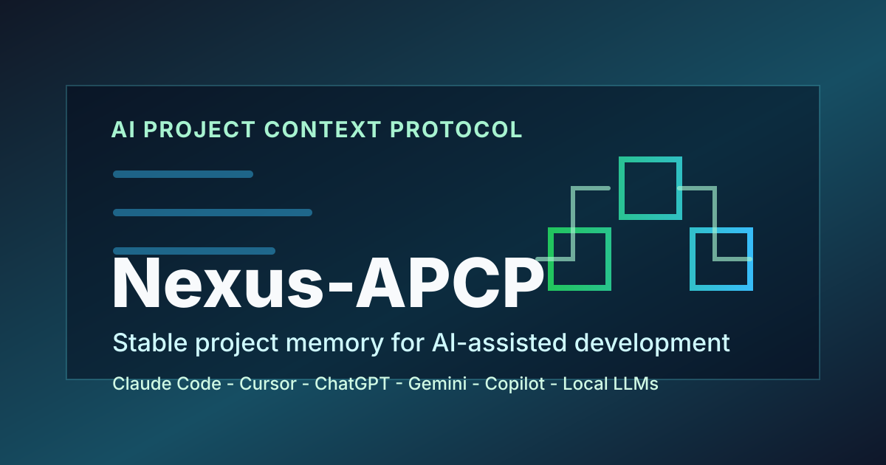

# Nexus-APCP: AI Project Context Protocol for AI-Assisted Development



[](./LICENSE)
[](#quick-start)
[](#what-nexus-apcp-solves)
[](#token-optimization-with-caveman-mode)

**Nexus-APCP** is an open-source **AI Project Context Protocol** for developers who work with AI coding assistants, AI agents, and large language models. It gives every AI session the same project memory, architecture rules, task state, decision history, and token-efficient operating style.

Use Nexus-APCP with **Claude Code, Cursor, ChatGPT, Gemini, GitHub Copilot, local LLMs, and multi-agent development workflows** to reduce context loss, repeated explanations, inconsistent code suggestions, and prompt bloat. It also gives teams a safe way to document AI tool and adapter differences without copying vendor system prompts into public repos.

> Security note: protocol templates may be public in this Nexus-APCP source repository, but downstream product repositories should keep installed Nexus-APCP operating files local or in an approved private/cloud knowledge base by default. Filled project-context files, backend maps, internal architecture diagrams, deployment maps, database internals, private threat models, and security runbooks should stay local/private unless sanitized and explicitly approved.

## What Nexus-APCP Solves

AI-assisted software development gets slower when every new model, chat, IDE agent, or pull request review starts from zero. Nexus-APCP creates a durable context layer for the repository so the AI can understand the project before it suggests code.

- **Persistent AI project context**: architecture, folder structure, conventions, security rules, and delivery gates stay in one reusable protocol.
- **Token optimization**: Caveman Mode keeps responses compact while preserving technical depth.
- **Decision memory**: architecture decision records explain why choices were made and reduce refactor loops.
- **Task continuity**: `TASK_PROGRESS.yaml` tracks active work, sprint goals, checkpoints, and quality gates.
- **Model portability**: move between Claude, Cursor, ChatGPT, Gemini, Copilot, and local agents without rebuilding context.
- **Skill-based agent workflows**: `AI_AGENT_SKILLS_PROTOCOL.md` turns repeated AI workflows into named, reusable operating patterns.
- **Multi-AI coordination**: `MACP_IMPLEMENTATION_GUIDE.md` defines handoff, heartbeat, state, and conflict-control patterns for parallel model workflows.
- **AI tool adapter compatibility**: `AI_TOOL_ADAPTER_COMPATIBILITY_PROTOCOL.md` documents tool modes, capabilities, verification paths, and prompt hygiene without vendoring leaked or proprietary prompts.
- **Local code graph support**: `CODEGRAPH_INTEGRATION_PROTOCOL.md` adds optional CodeGraph-compatible rules for local semantic code discovery, call tracing, impact analysis, and generated index hygiene.
- **Phase-gated delivery**: waterfall-style stack combination protocols help teams define requirements, contracts, tests, and release evidence before implementation drifts.
- **Lean application design**: debloat guidance helps teams avoid ads, hidden tracking, unnecessary dependencies, and non-essential modules by default.
- **README flowcharts**: Mermaid project flowcharts make repository entry points, architecture boundaries, and AI onboarding paths easier to scan.
- **File structure refactors**: existing projects can reorganize folders iteratively while preserving imports, scripts, tests, builds, and runtime entry points.
- **Website backend security**: static-first backend rules help teams avoid unnecessary SQL/auth/API surface for portfolio, landing, and brochure sites while still supporting secure growth into dynamic features.
- **User-requested update systems**: update-system fit checks help agents recommend a GitHub SemVer + zip-sync updater only when the project and user request make it appropriate.
- **Emoji-free output**: `EMOJI_POLICY.md` bans emoji in repository files and AI-generated output, with a user-approved temporary exception only for missing button icons.
- **Safer publishing**: domain-specific ignore and local-exclude guidance helps prevent secrets, internal maps, customer data, generated context, and downstream APCP operating files from leaking.

## Core Features

| Feature | What it does |
| :--- | :--- |
| AI Project Context Protocol | Keeps project identity, architecture, workflows, and constraints available to every AI session. |
| Caveman Compression | Reduces verbose AI output with short, high-signal technical language. |
| ADR-style Decision Log | Records technical intent so agents do not undo settled architecture. |
| Task Progress YAML | Gives humans and agents a shared source of truth for status, priorities, and checkpoints. |
| Prompt Templates | Provides ready-to-use prompts for implementation, review, debugging, refactoring, and handoff. |
| AI Agent Skills Protocol | Defines reusable skill workflows for diagnosis, TDD, triage, PRDs, handoff, architecture improvement, and prototyping. |
| Multi-AI Coordination Protocol | Defines MACP handoff, heartbeat, shared-state, and conflict-control patterns for parallel AI model workflows. |
| AI Tool Adapter Compatibility Protocol | Defines safe adapter compatibility checks for AI coding assistants, model/tool drift, mode differences, verification paths, and prompt-source hygiene. |
| CodeGraph Integration Protocol | Defines local code knowledge graph setup, agent usage, staleness checks, and `.codegraph/` publishing hygiene. |
| README Mermaid Flowcharts | Adds high-level Mermaid flowchart guidance so project READMEs explain application flow, architecture boundaries, and onboarding paths visually. |
| File Structure Refactor Protocol | Guides safe folder reorganization for existing projects with iterative moves, compatibility wrappers, reference updates, and verification gates. |
| Delivery Protocols | Adds release gates for web apps, backend services, AI/LLM products, games, mobile apps, DevOps, and security work. |
| Waterfall Stack Protocol | Defines phase-gated documentation, design, implementation, verification, worked examples, and official-source research fallback for mixed stacks such as web + database, web + Python, and Python + Unity. |
| Website Backend Security Protocol | Defines static-first website backend rules, API secret handling, database necessity checks, optimization gates, and authorized penetration-test closure. |
| Update System Recommendation Protocol | Guides AI agents to suggest a lightweight GitHub SemVer + zip-sync updater only when the user requests updates and the project profile fits. |
| Debloat Application Guide | Guides ad-free, consent-aware, dependency-light application design with optional features and measurable performance checks. |
| Emoji Policy | Bans emoji in repository content and AI output except user-approved temporary button icon placeholders. |
| GitHub Safety Rules | Includes broad ignore and local-exclude patterns for AI artifacts, protocol operating files, secrets, generated files, domain data, and private docs. |

## Quick Start

Clone the repository:

```bash
git clone https://github.com/AybarsBarut/Nexus-APCP.git
cd Nexus-APCP
```

Copy the protocol into your project:

```bash
cp AI_PROJECT_CONTEXT_PROTOCOL.md /your/project/
cp AI_MAIN.md /your/project/
cp TASK_PROGRESS.yaml /your/project/
cp DECISION_LOG_PROTOCOL.md /your/project/
cp CONTEXT_OPTIMIZATION.md /your/project/
cp CAVEMAN_RULES.md /your/project/
cp EMOJI_POLICY.md /your/project/
cp VISUAL_CONTEXT_MERMAID.md /your/project/
cp AI_AGENT_SKILLS_PROTOCOL.md /your/project/
cp AI_TOOL_ADAPTER_COMPATIBILITY_PROTOCOL.md /your/project/
cp CODEGRAPH_INTEGRATION_PROTOCOL.md /your/project/
cp FILE_STRUCTURE_REFACTOR_PROTOCOL.md /your/project/
cp AI_ASSISTANT_PROMPT_TEMPLATES.md /your/project/
cp WORKSPACE_SPECIFIC_DELIVERY_PROTOCOLS.md /your/project/
cp DOMAIN_SPECIFIC_GITIGNORE_PROTOCOLS.md /your/project/
cp MACP_IMPLEMENTATION_GUIDE.md /your/project/
cp WATERFALL_DEVELOPMENT_PROTOCOL.md /your/project/
cp UPDATE_SYSTEM_RECOMMENDATION_PROTOCOL.md /your/project/
cp DEBLOAT_APPLICATION_GUIDE.md /your/project/
cp WEBSITE_BACKEND_SECURITY_OPTIMIZATION_PROTOCOL.md /your/project/
mkdir -p /your/project/scripts
cp scripts/apcp_core_files.py /your/project/scripts/
cp scripts/apcp-gather.py /your/project/scripts/
cp scripts/install-local-excludes.sh /your/project/scripts/
cp scripts/install-local-excludes.ps1 /your/project/scripts/
```

The canonical install and gather file list lives in [`scripts/apcp_core_files.py`](./scripts/apcp_core_files.py). Repository validation fails if the README, setup guide, gather bundle, or validator drift from that list.

For a downstream product repository, treat these copied files as local agent operating context by default. AI agents can read them from local paths, private cloud docs, or generated context bundles, but the public GitHub repository does not need to expose the AI workflow files unless you intentionally publish sanitized templates. If the public repo should not show these files, run `bash scripts/install-local-excludes.sh` or `powershell -ExecutionPolicy Bypass -File scripts/install-local-excludes.ps1` before any push; use a committed `.gitignore` block only when the public ignore rule itself is acceptable.

Generate an AI-ready context package:

```bash
python scripts/apcp-gather.py --caveman
```

Paste the generated `PROMPT_READY.txt` into your AI assistant, or start with the ready-made prompt in [`MASTER_PROMPT.md`](./MASTER_PROMPT.md).

### Agent Bootstrap Without Search Indexing

If you ask Codex, Claude, Cursor, ChatGPT, Gemini, or another AI agent to install Nexus-APCP in a different project, paste this from that project's root:

```markdown
Set up Nexus-APCP in this repository.

Do not rely on search-index snippets or memory. Use exact source files from:
https://github.com/AybarsBarut/Nexus-APCP

Source priority:
1. If network access is available, fetch files from:
   https://raw.githubusercontent.com/AybarsBarut/Nexus-APCP/master/
2. If raw GitHub access is unavailable, ask me for a local clone/path or pasted files.
3. If neither source is available, create only clearly marked placeholders and list what must be synced later.

Git command rule:
- Do not run `git status`, `git add`, `git commit`, `git push`, or other Git commands during setup unless I explicitly ask.
- Inspect files and folders directly first.
- If Git state is truly needed, explain why and ask before running the command.

Public repository rule:
- Install Nexus-APCP files for local or approved private/cloud agent context by default.
- Before any GitHub push, keep installed APCP files, generated context bundles, private task state, and internal maps out of the public repository unless I explicitly approve sanitized public templates.
- Prefer `.git/info/exclude` or a private global excludes file when the public GitHub repo should not reveal local AI workflow files.

Install these core files when available:
- AI_PROJECT_CONTEXT_PROTOCOL.md
- AI_MAIN.md
- TASK_PROGRESS.yaml
- DECISION_LOG_PROTOCOL.md
- CONTEXT_OPTIMIZATION.md
- CAVEMAN_RULES.md
- EMOJI_POLICY.md
- VISUAL_CONTEXT_MERMAID.md
- AI_AGENT_SKILLS_PROTOCOL.md
- AI_TOOL_ADAPTER_COMPATIBILITY_PROTOCOL.md
- CODEGRAPH_INTEGRATION_PROTOCOL.md
- FILE_STRUCTURE_REFACTOR_PROTOCOL.md
- AI_ASSISTANT_PROMPT_TEMPLATES.md
- WORKSPACE_SPECIFIC_DELIVERY_PROTOCOLS.md
- DOMAIN_SPECIFIC_GITIGNORE_PROTOCOLS.md
- MACP_IMPLEMENTATION_GUIDE.md
- WATERFALL_DEVELOPMENT_PROTOCOL.md
- UPDATE_SYSTEM_RECOMMENDATION_PROTOCOL.md
- DEBLOAT_APPLICATION_GUIDE.md
- WEBSITE_BACKEND_SECURITY_OPTIMIZATION_PROTOCOL.md
- scripts/apcp_core_files.py
- scripts/apcp-gather.py
- scripts/install-local-excludes.sh
- scripts/install-local-excludes.ps1

Then inspect this project, customize placeholders, preserve secrets/private context, and run:
python scripts/apcp-gather.py --caveman
```

## Repository Contents

| File | Purpose |
| :--- | :--- |
| [`AI_PROJECT_CONTEXT_PROTOCOL.md`](./AI_PROJECT_CONTEXT_PROTOCOL.md) | Main project context template and operating rules. |
| [`AI_MAIN.md`](./AI_MAIN.md) | Execution orchestrator for AI sessions and workflow gates. |
| [`TASK_PROGRESS.yaml`](./TASK_PROGRESS.yaml) | Task tracking, sprint status, checkpoints, and velocity metrics. |
| [`DECISION_LOG_PROTOCOL.md`](./DECISION_LOG_PROTOCOL.md) | Architecture decision record protocol for intent preservation. |
| [`CONTEXT_OPTIMIZATION.md`](./CONTEXT_OPTIMIZATION.md) | Strategies for large codebases, context windows, and token limits. |
| [`CAVEMAN_RULES.md`](./CAVEMAN_RULES.md) | Token-efficient communication rules for concise AI output. |
| [`EMOJI_POLICY.md`](./EMOJI_POLICY.md) | Repository-wide and AI-wide ban on emoji usage, with a narrow user-approved temporary button icon exception. |
| [`VISUAL_CONTEXT_MERMAID.md`](./VISUAL_CONTEXT_MERMAID.md) | README Mermaid flowchart and visual context protocol for architecture, workflow, and state diagrams. |
| [`AI_AGENT_SKILLS_PROTOCOL.md`](./AI_AGENT_SKILLS_PROTOCOL.md) | Skill-based AI agent workflows adapted from public engineering-skill patterns for diagnosis, TDD, triage, PRDs, handoff, architecture review, and prototyping. |
| [`AI_TOOL_ADAPTER_COMPATIBILITY_PROTOCOL.md`](./AI_TOOL_ADAPTER_COMPATIBILITY_PROTOCOL.md) | Safe compatibility protocol for AI tool modes, adapter files, model/tool drift, verification paths, and prompt-source hygiene. |
| [`CODEGRAPH_INTEGRATION_PROTOCOL.md`](./CODEGRAPH_INTEGRATION_PROTOCOL.md) | Optional CodeGraph-compatible local code knowledge graph workflow for semantic search, call tracing, impact analysis, and safe generated-index handling. |
| [`FILE_STRUCTURE_REFACTOR_PROTOCOL.md`](./FILE_STRUCTURE_REFACTOR_PROTOCOL.md) | Safe file and folder reorganization protocol for existing projects, including iterative migration and verification gates. |
| [`AI_ASSISTANT_PROMPT_TEMPLATES.md`](./AI_ASSISTANT_PROMPT_TEMPLATES.md) | Prompt templates for common AI-assisted development scenarios. |
| [`WORKSPACE_SPECIFIC_DELIVERY_PROTOCOLS.md`](./WORKSPACE_SPECIFIC_DELIVERY_PROTOCOLS.md) | Delivery gates by workspace type and product domain. |
| [`MACP_IMPLEMENTATION_GUIDE.md`](./MACP_IMPLEMENTATION_GUIDE.md) | Multi-AI Coordination Protocol for parallel model workflows, handoffs, heartbeats, shared state, and conflict control. |
| [`WEBSITE_BACKEND_SECURITY_OPTIMIZATION_PROTOCOL.md`](./WEBSITE_BACKEND_SECURITY_OPTIMIZATION_PROTOCOL.md) | Static-first website backend security, API secret handling, database necessity, optimization, and penetration-test closure protocol. |
| [`UPDATE_SYSTEM_RECOMMENDATION_PROTOCOL.md`](./UPDATE_SYSTEM_RECOMMENDATION_PROTOCOL.md) | Fit-check protocol for recommending a lightweight update/version sync system only when user intent and project profile match. |
| [`DEBLOAT_APPLICATION_GUIDE.md`](./DEBLOAT_APPLICATION_GUIDE.md) | Lean application guide for reducing ads, hidden tracking, heavy dependencies, optional feature load, and resource usage. |
| [`WATERFALL_DEVELOPMENT_PROTOCOL.md`](./WATERFALL_DEVELOPMENT_PROTOCOL.md) | Phase-gated waterfall protocol with worked examples and web research rules for stack combinations such as web + database, web + Python, Python + Unity, backend APIs, Unity services, and AI/RAG workflows. |
| [`DOMAIN_SPECIFIC_GITIGNORE_PROTOCOLS.md`](./DOMAIN_SPECIFIC_GITIGNORE_PROTOCOLS.md) | Safe publishing patterns for different technical domains. |
| [`SETUP_GUIDE.md`](./SETUP_GUIDE.md) | Step-by-step setup instructions. |
| [`CHANGELOG.md`](./CHANGELOG.md) | Release history and SemVer notes for public protocol-kit versions. |
| [`scripts/apcp_core_files.py`](./scripts/apcp_core_files.py) | Canonical file list shared by gather, validation, and documentation consistency checks. |
| [`scripts/apcp-gather.py`](./scripts/apcp-gather.py) | Context packer that generates `PROMPT_READY.txt`. |
| [`scripts/install-local-excludes.sh`](./scripts/install-local-excludes.sh) and [`scripts/install-local-excludes.ps1`](./scripts/install-local-excludes.ps1) | Local Git exclude installers for downstream repositories that should keep APCP operating files private. |
| [`AGENTS.md`](./AGENTS.md) | Repository instructions for AI coding assistants and automation agents. |
| [`examples/`](./examples/README.md) | Sanitized starter kits for web apps, backend APIs, and AI/RAG systems. |

## How Nexus-APCP Works

1. **Capture project truth** in `AI_PROJECT_CONTEXT_PROTOCOL.md`: architecture, modules, conventions, security boundaries, tooling, and delivery rules.
2. **Track execution state** in `TASK_PROGRESS.yaml`: active tasks, priorities, estimates, dependencies, and quality gates.
3. **Preserve decisions** in `DECISION_LOG_PROTOCOL.md`: accepted tradeoffs, rejected paths, and architectural intent.
4. **Package context** with `scripts/apcp-gather.py`: combine the core protocol files into one prompt-ready bundle.
5. **Select reusable agent skills** with `AI_AGENT_SKILLS_PROTOCOL.md`: use named workflows for diagnosis, TDD, triage, PRDs, handoff, architecture improvement, and prototypes.
6. **Coordinate parallel models** with `MACP_IMPLEMENTATION_GUIDE.md`: use shared state, handoffs, heartbeats, and conflict rules when more than one AI agent is working.
7. **Document AI tool compatibility** with `AI_TOOL_ADAPTER_COMPATIBILITY_PROTOCOL.md`: track assistant modes, tool access, adapter files, verification paths, and safe prompt-source boundaries.
8. **Use local code intelligence** with `CODEGRAPH_INTEGRATION_PROTOCOL.md`: when a `.codegraph/` index exists, prefer targeted graph discovery before broad file scans, then verify against source and tests.
9. **Add README visual context** with `VISUAL_CONTEXT_MERMAID.md`: include a safe, high-level Mermaid flowchart in project READMEs for faster human and AI orientation.
10. **Refactor existing file layouts safely** with `FILE_STRUCTURE_REFACTOR_PROTOCOL.md`: move files iteratively, update references, and prove old code still runs from the new structure.
11. **Apply delivery protocols** such as `WORKSPACE_SPECIFIC_DELIVERY_PROTOCOLS.md`, `WEBSITE_BACKEND_SECURITY_OPTIMIZATION_PROTOCOL.md`, `WATERFALL_DEVELOPMENT_PROTOCOL.md`, `UPDATE_SYSTEM_RECOMMENDATION_PROTOCOL.md`, and `DEBLOAT_APPLICATION_GUIDE.md` when the work needs release gates, backend/API safety, stack contracts, update-system fit checks, lean app defaults, or phase-by-phase verification.
12. **Enforce output hygiene** with `EMOJI_POLICY.md`: keep docs, code, generated bundles, and AI responses emoji-free.
13. **Run compact AI sessions** with Caveman Mode: lower token usage, fewer repeated explanations, and cleaner handoffs.

## Ideal Use Cases

- AI-assisted software development teams using Claude Code, Cursor, ChatGPT, Gemini, Copilot, or local LLMs.
- Solo developers who want a reusable AI memory layer across projects.
- Agencies and freelancers who switch between many client repositories.
- AI agent workflows that need stable instructions, delivery gates, and handoff state.
- Open-source maintainers who want contributors and AI assistants to follow the same architecture rules.
- Teams that want repeatable AI agent skills for debugging, TDD, issue triage, PRD generation, and prototypes.
- Teams comparing or supporting multiple AI coding tools without copying private or leaked prompt text.
- Teams that want lean, privacy-respecting, dependency-conscious application defaults.
- Teams practicing context engineering, prompt engineering, ADRs, and token-optimized development.

## Token Optimization With Caveman Mode

Nexus-APCP includes the Caveman Protocol: short, direct, fragment-based technical communication for lower token cost and faster AI collaboration.

Normal AI style:

> I reviewed the authentication middleware and noticed a potential security flaw in the token validation logic. I recommend adding a null check before accessing the user property.

Caveman Mode:

> Auth middleware bug. Token validation lacks user null guard. Fix: add guard clause before access.

Same technical meaning, fewer tokens, easier scanning.

Activate it by running `python scripts/apcp-gather.py --caveman`, adding `PROTOCOL: CAVEMAN` to the active session, or asking the assistant to use Caveman Mode. Ask for normal detail or set `CAVEMAN_MODE: false` to suspend it.

## Versioning And Releases

See [`CHANGELOG.md`](./CHANGELOG.md) for release history. Nexus-APCP uses SemVer for public protocol-kit releases; `codemeta.json` and `CITATION.cff` version values should match a reviewed Git tag and GitHub release once that release is published.

This repository is a protocol and documentation kit with helper scripts. It is not packaged as an installable CLI unless a future release adds a `pyproject.toml`, entry points, tests, and release artifacts for commands such as `nexus-apcp gather`.

## Recommended GitHub Topics

For better GitHub discovery, use these repository topics:

`ai`, `ai-assisted-development`, `ai-agents`, `ai-agent-skills`, `context-engineering`, `prompt-engineering`, `llm`, `claude-code`, `cursor-ai`, `chatgpt`, `gemini`, `github-copilot`, `developer-productivity`, `token-optimization`, `architecture-decision-records`, `adr`, `documentation`, `software-development`, `devtools`, `open-source`

See [`docs/SEO_CHECKLIST.md`](./docs/SEO_CHECKLIST.md) for the full repository SEO checklist and metadata source of truth.

## Community and Maintenance

Nexus-APCP includes the repository hygiene expected from a serious open-source protocol kit:

- [`CONTRIBUTING.md`](./CONTRIBUTING.md): contribution rules and public-safety checklist.
- [`CODE_OF_CONDUCT.md`](./CODE_OF_CONDUCT.md): community standards.
- [`SECURITY.md`](./SECURITY.md): private-context and vulnerability-reporting policy.
- [`SUPPORT.md`](./SUPPORT.md): where to ask for help and what to keep private.
- [`.github/pull_request_template.md`](./.github/pull_request_template.md): PR checklist for docs, protocol, security, and metadata changes.
- [`.github/ISSUE_TEMPLATE/`](./.github/ISSUE_TEMPLATE/): structured issue forms for bugs, docs, protocol suggestions, and security-sensitive process notes.
- [`.github/workflows/validate.yml`](./.github/workflows/validate.yml): repository validation for required files, Python syntax, PowerShell syntax, YAML parsing, generated context cleanup, metadata, links, SVG, simple leak-pattern scanning, emoji policy, and context gathering.

## FAQ

### Is Nexus-APCP a prompt template or a protocol?

It is a protocol kit. Prompt templates are included, but the main value is the shared project context, task state, decision history, safety rules, and repeatable AI handoff workflow.

### Is Nexus-APCP a CLI?

No. Nexus-APCP is currently a protocol and documentation kit with small helper scripts for gathering and validation. Treat CLI packaging as a future release decision, not a current install surface.

### Does it work with any AI coding assistant?

Yes. Nexus-APCP is model-agnostic and works with hosted assistants, IDE agents, CLI agents, local LLMs, and multi-agent workflows.

### Is filled project context safe to publish?

Usually no. Filled project context can expose internal architecture, deployment topology, database internals, secrets, private prompts, security assumptions, and local AI workflow details. In downstream product repositories, keep installed APCP operating files local or in approved private/cloud knowledge bases by default. Publish sanitized templates, not private implementation maps.

### Why use YAML for task tracking?

YAML is easy for humans to read, easy for AI models to update, and structured enough to keep task status consistent across sessions.

## Related Keywords

AI project context protocol, context engineering, AI-assisted development, AI coding assistant workflow, AI agent skills, skill-based agent workflows, AI tool adapter compatibility, AI coding tool compatibility, local code graph, semantic code search, code intelligence, impact analysis, model tool drift, prompt-source hygiene, prompt engineering, LLM project memory, AI agent handoff, token optimization, Mermaid flowchart, README architecture diagram, file structure refactor, repository reorganization protocol, architecture decision records, ADR protocol, website backend security protocol, secure web development, backend optimization, waterfall development protocol, phase-gated delivery, stack combination documentation, application debloat guide, lean application design, privacy-first analytics, dependency minimalism, ad-free applications, Claude Code workflow, Cursor AI workflow, ChatGPT coding workflow, Gemini coding workflow, GitHub Copilot workflow, developer productivity toolkit.

## License

Distributed under the MIT License. See [`LICENSE`](./LICENSE) for details.

**Nexus-APCP: stable project memory for AI-native software engineering.**
