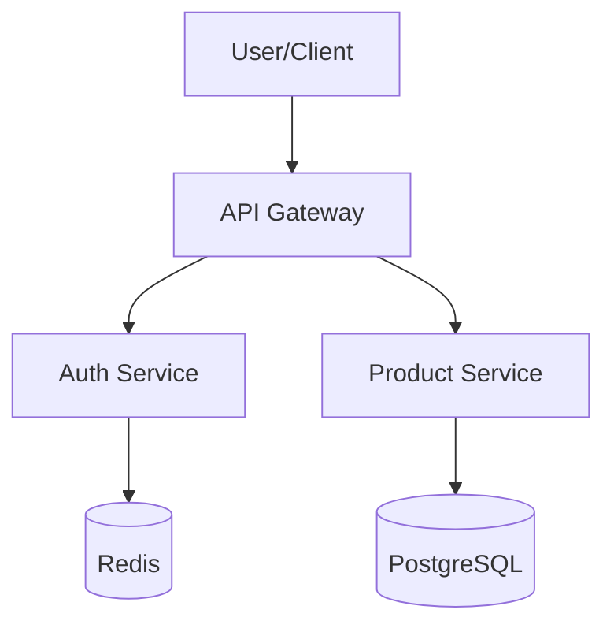
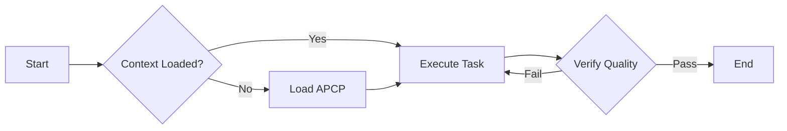
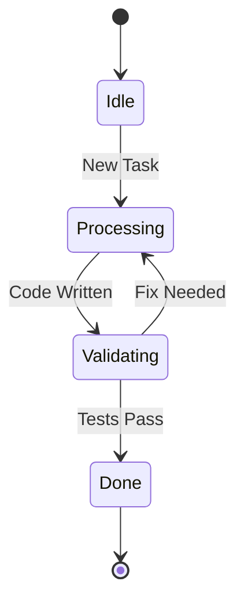

# 📊 Visual Context Protocol: Mermaid Flowcharts

## 🎯 Purpose
Provide developers and AI agents with a standardized way to visualize project architecture, workflows, and state transitions using [Mermaid.js](https://mermaid-js.github.io/mermaid/). Visual diagrams reduce cognitive load and help AI assistants understand complex relationships faster.

## ⚙️ Why use Mermaid?
- **Text-Based**: Diagrams are stored as code (Markdown), making them version-controllable and token-efficient.
- **AI-Friendly**: LLMs are excellent at generating and parsing Mermaid syntax.
- **IDE Support**: Most modern IDEs (Cursor, VS Code, Obsidian) and GitHub/GitLab render Mermaid natively.

---

## 🏗️ Core Diagram Types

### 1. Architecture Map (High-Level)
Use flowcharts to map directory structures, service boundaries, and data flow.

### 2. Workflow / Logic Flow
Visualize complex business logic or AI execution paths.

### 3. State Machine
Track the lifecycle of a task, order, or system state.

---

## 🤖 Instructions for AI Agents

When an AI agent is asked to "visualize" or "explain the architecture," it should:
1. **Identify Entities**: Determine the key components, files, or services.
2. **Define Relationships**: Map how data or control flows between them.
3. **Generate Mermaid**: Output a valid `mermaid` code block.
4. **Prefer Flowcharts**: Use `graph TD` (Top-Down) or `graph LR` (Left-Right) for most scenarios.

**Prompt Snippet for Humans:**
> "Generate a Mermaid flowchart explaining how the [Module Name] interacts with the database and external APIs."

---

## 🛠️ Integration with Nexus-APCP

- **Location**: Store complex diagrams in `docs/diagrams/` or embed them directly in `AI_PROJECT_CONTEXT_PROTOCOL.md`.
- **Decision Logs**: Use Mermaid in `DECISION_LOG_PROTOCOL.md` to show "Before" vs "After" architecture during major refactors.
- **Task Progress**: Use state diagrams to visualize long-running multi-stage tasks.

---
*Nexus-APCP: Visualizing logic for faster engineering.* 📈🚀
