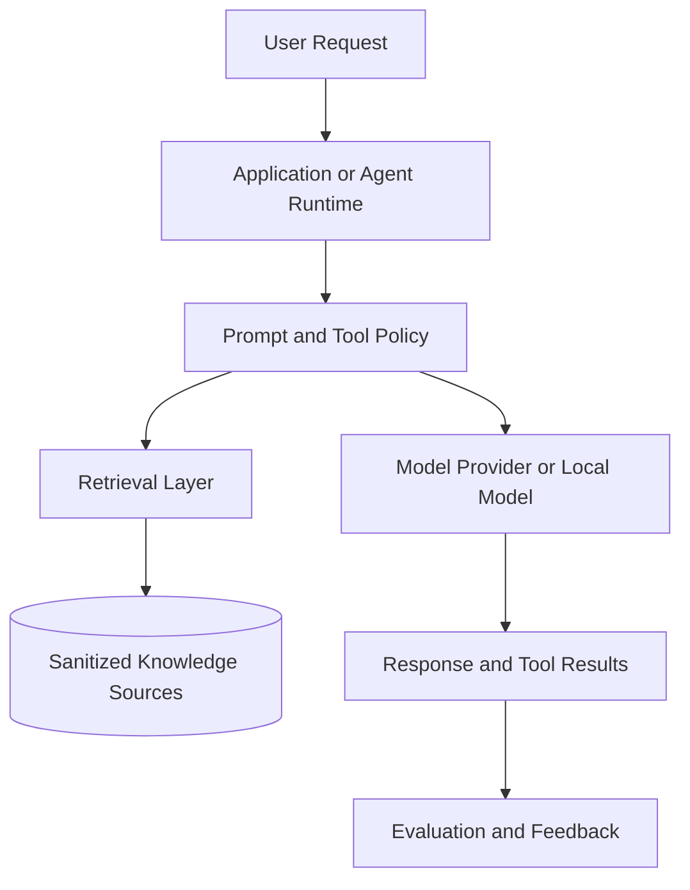

# AI / RAG APCP Example

Use this starter when adopting Nexus-APCP in an AI product, RAG pipeline, agent workflow, prompt system, or LLM-powered application.

## Project Identity Template

```yaml
Project Name: [AI_PRODUCT_NAME]
Description: AI system that helps [AUDIENCE] with [TASK]
Model Providers: [OpenAI/Anthropic/Gemini/local/etc]
Retrieval: [VECTOR_DB/SEARCH/NONE]
Data Sources: [SANITIZED_SOURCE_TYPES]
Evaluation: [EVAL_APPROACH]
Deployment: [HOSTING_OR_RUNTIME]
```

## Context Sections to Fill First

- User tasks and model responsibilities.
- Prompt boundaries and system/developer instruction ownership.
- Retrieval sources, indexing flow, and freshness expectations.
- Evaluation datasets, pass/fail criteria, and regression checks.
- Safety rules for private data, prompt injection, and tool permissions.
- Observability: traces, prompt/version logs, feedback, and cost tracking.
- Fallback behavior when retrieval, tools, or model calls fail.

## README Project Flow Example

Add a Mermaid flowchart like this to the target project's root `README.md` so reviewers can understand the model path, retrieval path, and evaluation loop before reading private implementation notes.



Keep this diagram public-safe. Do not include private prompts, proprietary datasets, raw user conversations, vector database exports, provider secrets, or sensitive tool-permission details.

## Initial Task Examples

```yaml
tasks:
  - id: AI-001
    title: "Document prompt ownership and tool permissions"
    status: TODO
    priority: HIGH
  - id: AI-002
    title: "Define retrieval source map and freshness rules"
    status: TODO
    priority: HIGH
  - id: AI-003
    title: "Create evaluation checklist and regression prompts"
    status: TODO
    priority: MEDIUM
```

## AI Assistant Startup Prompt

```text
Read AI_PROJECT_CONTEXT_PROTOCOL.md and TASK_PROGRESS.yaml.
Focus on prompt ownership, data boundaries, retrieval assumptions, tool permissions, and evaluation criteria.
Tell me what context is missing before changing prompts or agent behavior.
```

## Safety Notes

- Do not publish private prompts, proprietary datasets, raw user conversations, vector database exports, model weights, or generated context bundles.
- Treat prompt injection handling and tool permission details as sensitive unless written as sanitized guidance.
