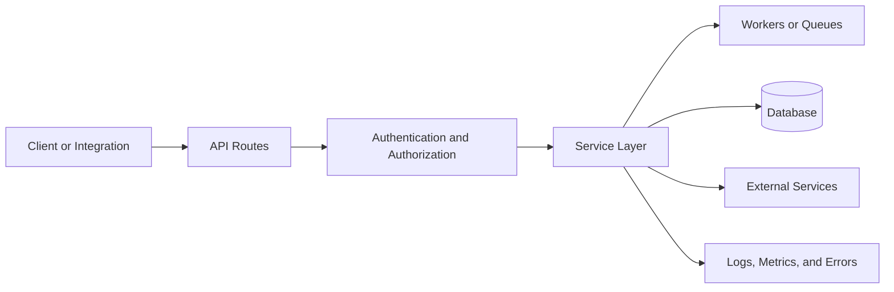

# Backend API APCP Example

Use this starter when adopting Nexus-APCP in an API, backend service, worker, or integration platform.

## Project Identity Template

```yaml
Project Name: [SERVICE_NAME]
Description: Backend service that provides [CAPABILITY]
Runtime: [Node/Python/Go/Java/etc]
Framework: [FastAPI/Express/Spring/etc]
Database: [PostgreSQL/MySQL/MongoDB/etc]
External Services: [PAYMENTS/EMAIL/STORAGE/QUEUE]
Deployment: [CONTAINER_OR_PLATFORM]
```

## Context Sections to Fill First

- API endpoints and request/response contracts.
- Data model ownership and migration rules.
- Service boundaries and dependency direction.
- Authentication, authorization, and rate-limit rules.
- Background jobs, queues, and retry behavior.
- Observability: logs, metrics, traces, and alerting.
- Test strategy for unit, integration, contract, and migration tests.

## README Project Flow Example

Add a Mermaid flowchart like this to the target project's root `README.md` so contributors can scan the service boundary, request path, and persistence layer quickly.



Keep this diagram public-safe. Do not include internal hostnames, real connection strings, private queue names, customer identifiers, or security-sensitive operational details.

## Initial Task Examples

```yaml
tasks:
  - id: API-001
    title: "Document endpoint map and ownership"
    status: TODO
    priority: HIGH
  - id: API-002
    title: "Define database migration and rollback rules"
    status: TODO
    priority: HIGH
  - id: API-003
    title: "Create error taxonomy and response format"
    status: TODO
    priority: MEDIUM
```

## AI Assistant Startup Prompt

```text
Read AI_PROJECT_CONTEXT_PROTOCOL.md and TASK_PROGRESS.yaml.
Prioritize API contracts, data ownership, service boundaries, and security rules.
Before editing, identify the current task, migration risk, and test surface.
```

## Safety Notes

- Do not include real connection strings, production hostnames, credentials, customer data, private API keys, or internal network maps.
- Security fixes should use neutral functional wording in public commits and PRs.
