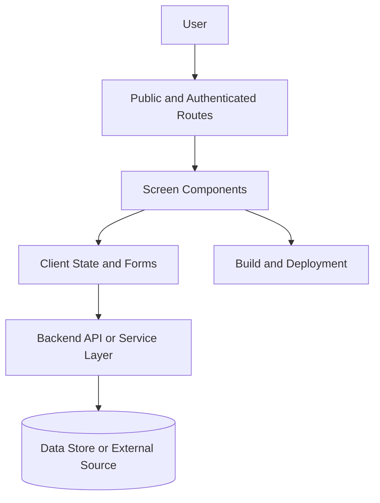

# Web App APCP Example

Use this starter when adopting Nexus-APCP in a frontend or full-stack web application.

## Project Identity Template

```yaml
Project Name: [WEB_APP_NAME]
Description: User-facing web app for [AUDIENCE] to [OUTCOME]
Primary Users: [USER_TYPES]
Frontend: [React/Vue/Svelte/Next/etc]
Backend: [API_OR_SERVICE]
Data Store: [DATABASE_OR_NONE]
Deployment: [HOSTING_PROVIDER]
```

## Context Sections to Fill First

- Product goal and non-goals.
- Route map and major screens.
- Component structure and design system rules.
- API contracts and error states.
- Authentication and authorization boundaries.
- Test strategy for unit, integration, and browser tests.
- Accessibility and responsive design requirements.

## README Project Flow Example

Add a Mermaid flowchart like this to the target project's root `README.md` so humans and AI assistants can understand the application path before opening deeper docs.



Keep this diagram public-safe. Do not include private admin routes, production hostnames, internal service names, analytics keys, or security-sensitive control details.

## Initial Task Examples

```yaml
tasks:
  - id: WEB-001
    title: "Map primary routes and user flows"
    status: TODO
    priority: HIGH
  - id: WEB-002
    title: "Document component and styling conventions"
    status: TODO
    priority: HIGH
  - id: WEB-003
    title: "Define API error handling and loading states"
    status: TODO
    priority: MEDIUM
```

## AI Assistant Startup Prompt

```text
Read AI_PROJECT_CONTEXT_PROTOCOL.md and TASK_PROGRESS.yaml.
Focus on the web app routes, component conventions, API boundaries, and accessibility requirements.
Tell me the next task and the files you need before editing.
```

## Safety Notes

- Do not paste real analytics keys, auth provider secrets, customer IDs, session tokens, or production environment files.
- Keep internal admin routes and security assumptions private unless sanitized.
