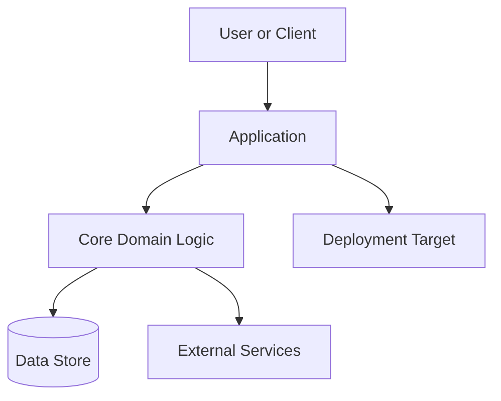
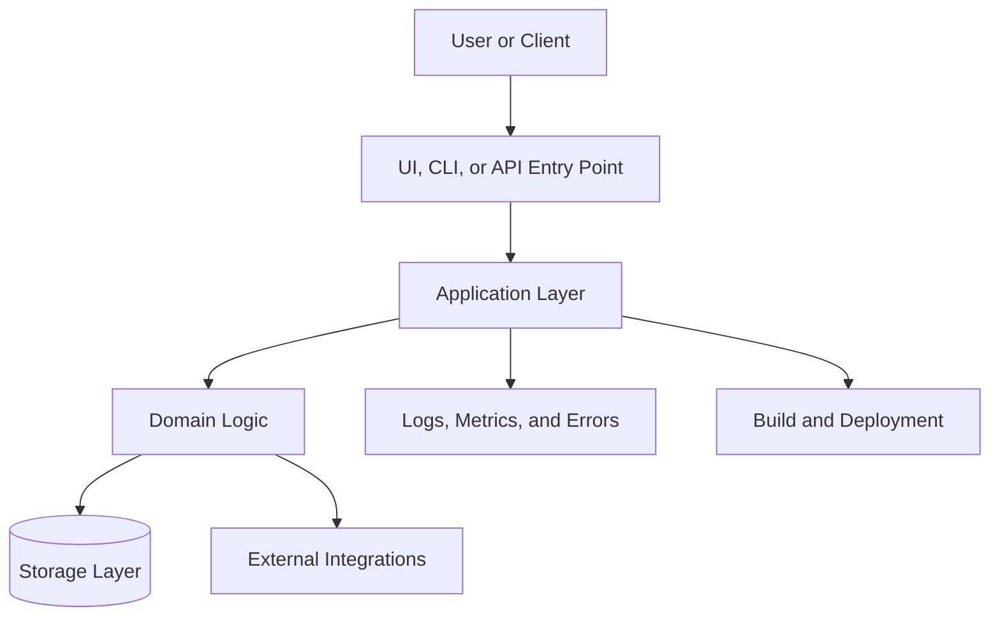
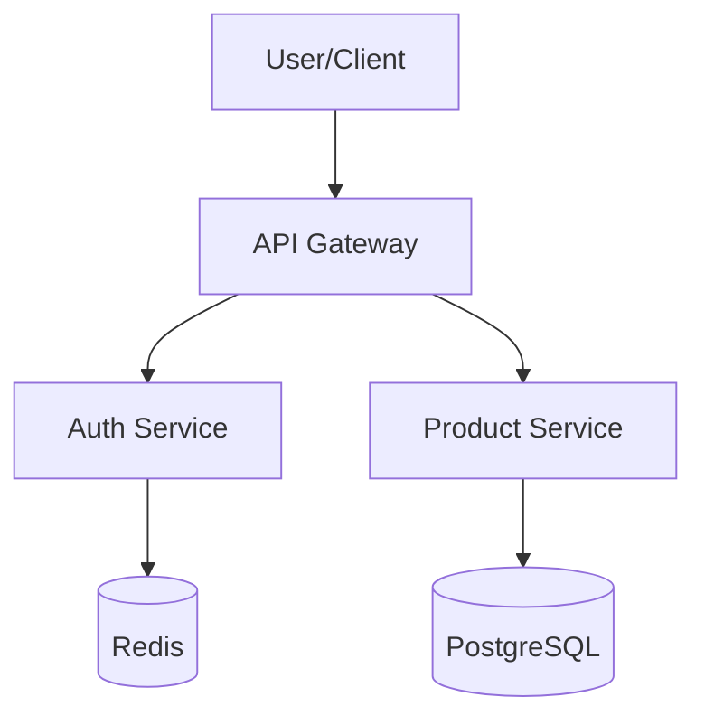
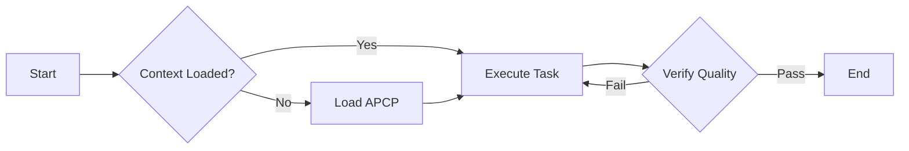
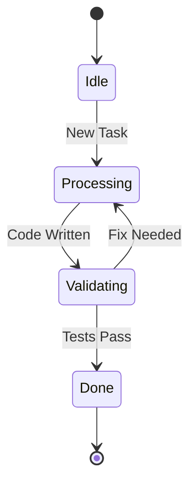

# Visual Context Protocol: Mermaid Flowcharts

## Purpose
Provide developers and AI agents with a standardized way to visualize project architecture, workflows, and state transitions using [Mermaid.js](https://mermaid-js.github.io/mermaid/). Visual diagrams reduce cognitive load and help AI assistants understand complex relationships faster.

## Why use Mermaid?
- **Text-Based**: Diagrams are stored as code (Markdown), making them version-controllable and token-efficient.
- **AI-Friendly**: LLMs are excellent at generating and parsing Mermaid syntax.
- **IDE Support**: Most modern IDEs (Cursor, VS Code, Obsidian) and GitHub/GitLab render Mermaid natively.

---

## Core Diagram Types

### 1. README Project Flowchart
Every project that adopts Nexus-APCP should include a small Mermaid flowchart in its root `README.md`. The diagram should help a first-time reader understand the project shape before they open deeper documentation.

Use this README flowchart for:
- Public project orientation.
- Contributor onboarding.
- AI assistant context loading.
- Quick review of app, service, data, and deployment boundaries.

Keep the README diagram high-level. Do not include private infrastructure names, internal hostnames, secret paths, customer data, security runbooks, or production-only topology details. If the project is public, the README diagram must be safe for public release.

Recommended placement:

````markdown
## Project Flow


````

README flowchart rules:
- Use `flowchart TD` when the reader should scan from entry point to outcome.
- Use `flowchart LR` when the project is a pipeline, workflow, or integration chain.
- Use clear human labels, not internal class names, unless those names are already public documentation terms. Mermaid graphs generate tokens based on their syntax length and nodes. Avoid unnecessary edge labels or stylistic parameters unless they clarify architectural decisions. For large systems, link from `[../AI_PROJECT_CONTEXT_PROTOCOL.md]` to an external mermaid file instead of inline rendering.
- Keep the diagram between 5 and 9 nodes for the root README.
- Link to `docs/ARCHITECTURE.md` or `AI_PROJECT_CONTEXT_PROTOCOL.md` for deeper diagrams.
- Review the diagram whenever a major feature, service, storage layer, or deployment target changes.
- Prefer neutral terms such as `API`, `Worker`, `Database`, `Cache`, `External Service`, and `Deployment Target`.
- Do not use emoji or decorative symbols in node labels.

Detailed README section template:

````markdown
## Project Flow

This flowchart shows the public, high-level path through the project. It is intentionally simplified so new contributors and AI assistants can understand the repository before reading implementation details.



For deeper architecture details, see `docs/ARCHITECTURE.md` in the adopting project or [`AI_PROJECT_CONTEXT_PROTOCOL.md`](../AI_PROJECT_CONTEXT_PROTOCOL.md).
````

### 2. Architecture Map (High-Level)
Use flowcharts to map directory structures, service boundaries, and data flow.



### 3. Workflow / Logic Flow
Visualize complex business logic or AI execution paths.



### 4. State Machine
Track the lifecycle of a task, order, or system state.



---

## Instructions for AI Agents

When an AI agent is asked to "visualize" or "explain the architecture," it should:
1. **Identify Entities**: Determine the key components, files, or services.
2. **Define Relationships**: Map how data or control flows between them.
3. **Generate Mermaid**: Output a valid `mermaid` code block.
4. **Prefer Flowcharts**: Use `flowchart TD` (Top-Down) or `flowchart LR` (Left-Right) for most scenarios.
5. **Update README When Useful**: If the requested work changes the project-level architecture, onboarding path, core workflow, or public feature map, propose or add a root `README.md` Mermaid flowchart update.

**Prompt Snippet for Humans:**
> "Generate a Mermaid flowchart explaining how the [Module Name] interacts with the database and external APIs."

---

## Integration with Nexus-APCP

- **README Requirement**: Add a simple Mermaid project flowchart to the root `README.md` for repositories that adopt Nexus-APCP.
- **Location**: Store complex diagrams in `docs/diagrams/` or embed them directly in `AI_PROJECT_CONTEXT_PROTOCOL.md`.
- **Decision Logs**: Use Mermaid in `DECISION_LOG_PROTOCOL.md` to show "Before" vs "After" architecture during major refactors.
- **Task Progress**: Use state diagrams to visualize long-running multi-stage tasks.

---
*Nexus-APCP: Visualizing logic for faster engineering.* 
